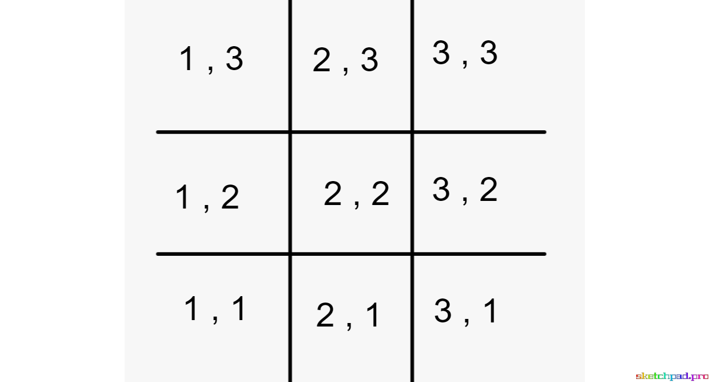

# Winning Move
## Prompt
Given two locations on a tictactoe board that are either in the same row or column, tell the player what row or column the next move should be. 

### Setup
The tictactoe board uses coordinate like locations with x axis(or column) value first then y axis (or row) value second.

  

### Input
Your function should receieve 2 arrays as parameters, each holding the x and y coordinates of 2 previous moves on the board. 

### Output
Your function should return a string which tells the user what row or column the next move should be in. 

### Extra
More time? What is the exact location (coordinate) of the winning move?

### Hint
You may use . . .

`nameOfTheArray.splice(nameOfTheArray.indexOf(value), 1) 
`

to remove a value from an array for which you don't know the index of.

---------------
## Solution
### Example
winningMove([1,3],[3,3]) //should return "winning move in row 3"

    function winningMove(loc1, loc2){
      let winningMove="Winning move is in "
      //same column
      if(loc1[0] == loc2[0]){
        winningMove+="column "+loc1[0]
      }
      //same row
      else{
        winningMove+="row "+loc1[1]
      }
      //same diagnol
      return winningMove;
    }

console.log(winningMove([1,3],[3,3]));
//Winning move is in row 3
console.log(winningMove([1,3],[2,3]));
//Winning move is in row 3
console.log(winningMove([1,3],[1,1]));
//Winning move is in column 1 
console.log(winningMove([1,3],[1,2]));
//Winning move is in column 1

    function winningMoveExtra(loc1, loc2){
      let winningMove="Winning move is in "
      let possibleLocations=[1,2,3]
      //same column
      if(loc1[0] == loc2[0]){
        possibleLocations.splice(possibleLocations.indexOf(loc1[1]), 1);
        possibleLocations.splice(possibleLocations.indexOf(loc2[1]), 1);
        winningMove+="column "+loc1[0]+ " row "+ possibleLocations[0]
      }
      //same row
      else{
        possibleLocations.splice(possibleLocations.indexOf(loc1[0]), 1);
        possibleLocations.splice(possibleLocations.indexOf(loc2[0]), 1);
        winningMove+="row "+loc1[1] + " column "+ possibleLocations[0]
      }
      //same diagonal
      return winningMove;
    }

console.log(winningMoveExtra([1,3],[3,3]));
//Winning move is in row 3 column 2
console.log(winningMoveExtra([1,3],[2,3]));
//Winning move is in row 3 column 3
console.log(winningMoveExtra([1,3],[1,1]));
//Winning move is in column 1 row 2
console.log(winningMoveExtra([1,3],[1,2]));
//Winning move is in column 1 row 1
